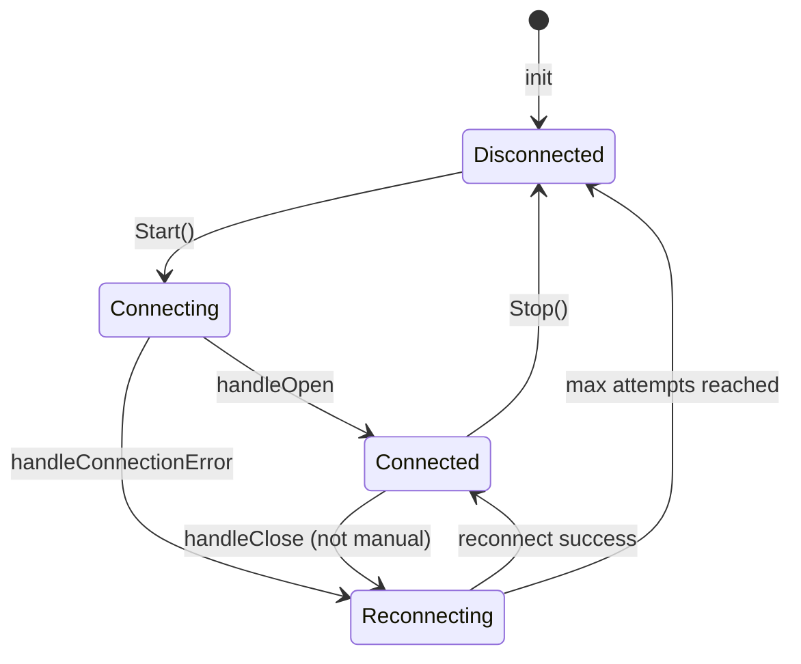
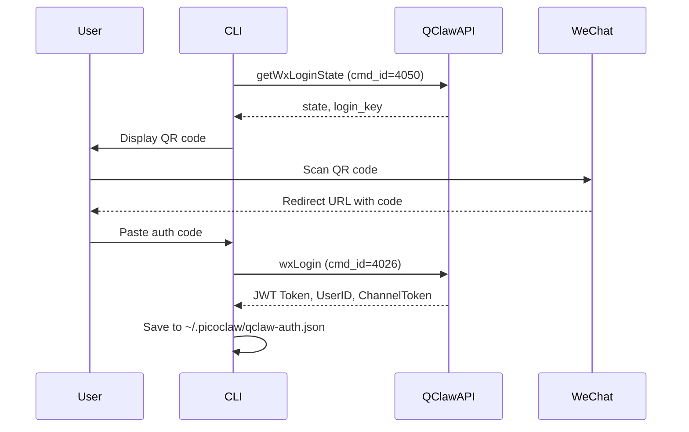

# QClaw Channel Architecture

## 1. Identity

- **What it is:** PicoClaw channel for WeChat service account integration via QClaw AGP (Agent Gateway Protocol).
- **Purpose:** Enables bidirectional real-time messaging between WeChat users and AI agent through QClaw's WebSocket gateway.

## 2. Core Components

- `pkg/channels/qclaw/qclaw.go` (`QClawChannel`): Main channel implementation, handles AGP protocol and message routing.
- `pkg/channels/qclaw/websocket.go` (`WebSocketClient`): AGP WebSocket client with heartbeat, reconnection, and wakeup detection.
- `pkg/channels/qclaw/auth.go` (`QClawAPI`, `AuthStateManager`): JPRX gateway API client and token persistence.
- `pkg/channels/qclaw/types.go`: AGP protocol type definitions (`AGPEnvelope`, `PromptPayload`, `UpdatePayload`, etc.).
- `pkg/channels/qclaw/init.go`: Factory registration for channel manager.
- `cmd/picoclaw/internal/qclaw/command.go`: CLI commands for authentication (`login`, `logout`, `status`).

## 3. Execution Flow (LLM Retrieval Map)

### Inbound Message Flow (WeChat → Agent)

```
WeChat User → QClaw Gateway → WebSocket (session.prompt) → QClawChannel.OnPrompt()
    → BaseChannel.HandleMessage() → MessageBus.PublishInbound() → Agent Loop
```

**Key Files:**
- `pkg/channels/qclaw/websocket.go:handleRawMessage`: Parses AGP envelope, deduplicates by msg_id, dispatches by method.
- `pkg/channels/qclaw/qclaw.go:OnPrompt`: Extracts content, creates PromptTask, calls `HandleMessage`.

### Outbound Message Flow (Agent → WeChat)

```
Agent → MessageBus.PublishOutbound() → QClawChannel.Send()
    → WebSocket.SendMessageChunk() (session.update)
    → [Idle Timeout] → WebSocket.SendPromptResponse() (session.promptResponse)
```

**Key Files:**
- `pkg/channels/qclaw/qclaw.go:Send`: Accumulates content, sends `session.update`, schedules auto-finalization.
- `pkg/channels/qclaw/qclaw.go:finalizePromptResponse`: Sends `session.promptResponse` with accumulated content.

### WebSocket Connection Lifecycle



**Key Features:**
- **Heartbeat:** 20s ping interval, 40s pong timeout detection
- **Reconnection:** Exponential backoff (base 3s, max 25s), unlimited retries
- **Wakeup Detection:** 15s threshold to detect system sleep/wake
- **Message Deduplication:** LRU cache with 1000 entries, 10min TTL

## 4. AGP Protocol

### Message Envelope

All WebSocket messages use the `AGPEnvelope` structure:

```json
{
  "msg_id": "uuid-v4",
  "guid": "device-guid",
  "user_id": "user-id",
  "method": "session.prompt|session.cancel|session.update|session.promptResponse",
  "payload": {}
}
```

### Method Types

| Method | Direction | Description |
|--------|-----------|-------------|
| `session.prompt` | Server → Client | User message, triggers agent processing |
| `session.cancel` | Server → Client | Cancel ongoing prompt |
| `session.update` | Client → Server | Streaming text chunks, tool call updates |
| `session.promptResponse` | Client → Server | Final response with stop reason |

### Stop Reasons

| Value | Description |
|-------|-------------|
| `end_turn` | Normal completion |
| `cancelled` | User cancelled |
| `refusal` | Agent refused |
| `error` | Error occurred |

## 5. Configuration

### Configuration Structure

```go
type QClawConfig struct {
    Enabled            bool                `json:"enabled"`
    Token              string              `json:"token"`              // WebSocket auth token
    WebSocketURL       string              `json:"websocket_url"`      // Default: wss://mmgrcalltoken.3g.qq.com/agentwss
    GUID               string              `json:"guid"`               // Device GUID (auto-generated if empty)
    UserID             string              `json:"user_id"`            // User account ID
    Environment        string              `json:"environment"`        // "production" or "test"
    AuthStatePath      string              `json:"auth_state_path"`    // Custom auth state file path
    AllowFrom          FlexibleStringSlice `json:"allow_from"`         // User allowlist
    GroupTrigger       GroupTriggerConfig  `json:"group_trigger"`      // Group chat trigger config
    HeartbeatInterval  time.Duration       `json:"heartbeat_interval"` // Default: 20s
    ReconnectInterval  time.Duration       `json:"reconnect_interval"` // Default: 3s
    MaxReconnects      int                 `json:"max_reconnects"`     // 0 = unlimited
}
```

### Example Configuration`r`n`r`nJSON config currently uses raw `time.Duration` values, so examples below are shown in nanoseconds.

```json
{
  "channels": {
    "qclaw": {
      "enabled": true,
      "token": "your-websocket-token",
      "websocket_url": "wss://mmgrcalltoken.3g.qq.com/agentwss",
      "user_id": "your-user-id",
      "allow_from": ["user1", "user2"],
      "heartbeat_interval": 20000000000,
      "reconnect_interval": 3000000000
    }
  }
}
```

## 6. CLI Commands

### Login

```bash
picoclaw qclaw login [--environment production|test] [--bypass-invite] [--auth-path /custom/path]
```

Prompts user to scan QR code with WeChat, exchanges OAuth code for token, saves credentials to `~/.picoclaw/qclaw-auth.json`.

### Logout

```bash
picoclaw qclaw logout [--auth-path /custom/path]
```

Clears stored authentication credentials.

### Status

```bash
picoclaw qclaw status [--auth-path /custom/path]
```

Displays current authentication status including user ID, GUID, and token expiry.

## 7. Authentication Flow



## 8. Design Rationale

### Reactive Channel Pattern

QClaw is a reactive-only channel—it can only respond to incoming prompts, not initiate conversations. This matches the AGP protocol's request-response model where the server drives the conversation.

### Prompt Task Tracking

Each incoming `session.prompt` creates a `PromptTask` that tracks:
- Session ID and Prompt ID for response correlation
- Accumulated response content for streaming
- Timer for auto-finalization after idle timeout (250ms)

### Exponential Backoff Reconnection

Uses formula `min(base × 1.5^(n-1), 25000ms)` to avoid thundering herd after server outages while ensuring eventual reconnection.

### Message Deduplication

Two-level deduplication:
1. WebSocket client: LRU cache for msg_id deduplication
2. Channel level: TTL-based deduplication for processed prompts

## 9. Related Files

- `pkg/channels/qclaw/qclaw.go`: Channel implementation
- `pkg/channels/qclaw/websocket.go`: AGP WebSocket client
- `pkg/channels/qclaw/auth.go`: Authentication and state management
- `pkg/channels/qclaw/types.go`: Protocol type definitions
- `pkg/config/config.go`: QClawConfig definition
- `cmd/picoclaw/internal/qclaw/command.go`: CLI commands
